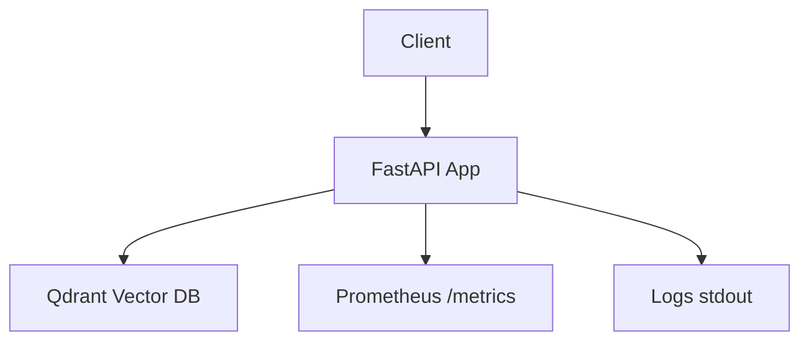
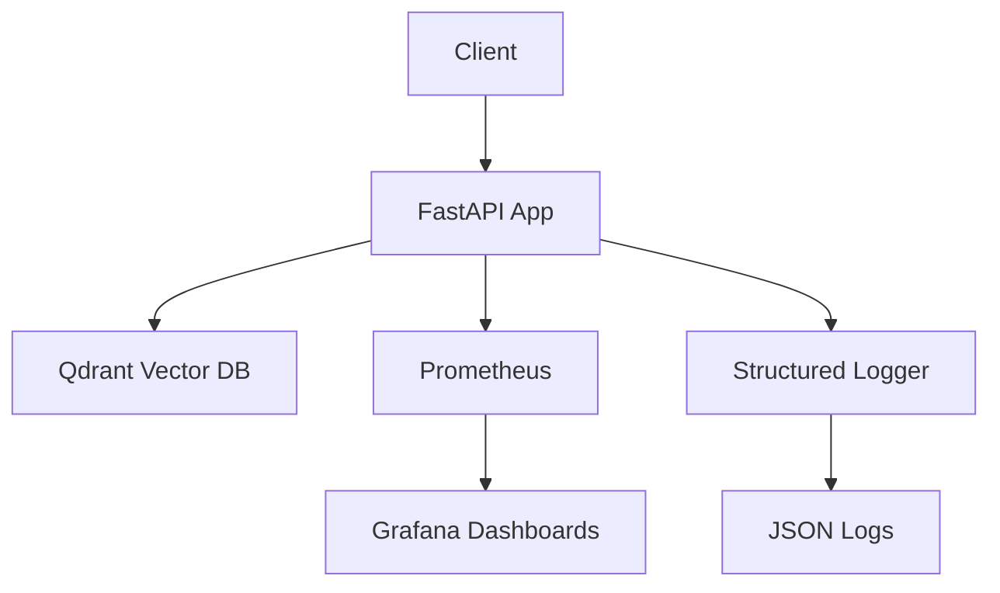

# 🧠 AI Memory System Architecture Roadmap

## Current Status (November 3, 2025)

### Stage 0-1: Foundation + Basic Vector Operations ✅
- [x] FastAPI app with health checks
- [x] Qdrant vector database integration
- [x] Basic endpoints (/upsert, /query)
- [x] Docker optimization (6.2s builds)
- [x] Initial tests (20 passing)
- [x] Prometheus metrics endpoint
- [x] Structured JSON logging implemented ✨
- [ ] Production deployment

### Stage 2: Production Observability 🔄
- [x] Structured JSON logging with levels ✅
- [x] Prometheus integration (port 9090) ✅
- [x] Grafana dashboards (port 3000) ✅
- [x] Global error handling with logging ✅
- [ ] Custom Grafana dashboards
- [ ] Error tracking aggregation
- [ ] Load testing (k6 integration)
- [ ] Production deployment on Railway
- [ ] CI/CD pipeline with GitHub Actions

### What Just Got Implemented (Stage 2 Progress):
**1. Structured JSON Logging:**
- Created `logging_config.py` with custom JSON formatter
- All logs now output as JSON with: timestamp, level, logger, message, context
- Replaced all `print()` statements with structured logger calls
- Context includes: vector_count, elapsed_ms, error_type, throughput, etc.
- Example log: `{"timestamp": "2025-11-03T12:16:09+0000", "level": "INFO", "logger": "ai_memory_system", "message": "Upsert completed successfully", "vector_count": 100, "elapsed_ms": 45.23}`

**2. Observability Stack:**
- Prometheus server scraping metrics every 5s
- Grafana dashboards provisioned automatically
- Dashboard panels: Request Rate, Latency (p50/p95/p99), HTTP Status Codes, Requests by Endpoint
- Access: http://localhost:3000 (admin/admin)

**3. Global Exception Handling:**
- HTTP exceptions logged with context
- Unexpected exceptions caught and logged with stack traces
- User-friendly error responses
- All errors tracked in structured logs

### Services Running:
- FastAPI: http://localhost:8000
- Qdrant: http://localhost:6333
- Prometheus: http://localhost:9090
- Grafana: http://localhost:3000 (admin/admin)

### Stage 3: Advanced Features 📋
- [ ] Multi-tenancy support
- [ ] Rate limiting and API keys
- [ ] Batch vector operations
- [ ] Vector space visualization
- [ ] Custom distance metrics
- [ ] Error telemetry

### Stage 4: Production Hardening 🛡️
- [ ] Load balancing
- [ ] Backup & restore
- [ ] Disaster recovery
- [ ] Security scanning
- [ ] Performance profiling
- [ ] Cost optimization

## System Architecture

### Current Components


### Stage 2 Components (Next)


## Data Flow

### Vector Storage Flow
1. Client sends vector(s) to `/upsert`
2. FastAPI validates dimensions (384)
3. Qdrant stores with unique ID
4. Returns success/failure

### Query Flow
1. Client sends query vector
2. FastAPI validates format
3. Qdrant performs similarity search
4. Returns top-K matches

## Development Flow

### Current Setup
- Local: `just dev` (hot reload)
- Test: `just test` (20 tests)
- Build: `just docker-build` (6.2s)
- Run: `just docker-up` 

### Stage 2 Additions
- Logging: JSON format to stdout
- Metrics: Grafana dashboards
- Deploy: Railway integration
- CI/CD: GitHub Actions

## Key Metrics

### Current Performance
- Build time: 6.2 seconds
- Image size: 350MB
- Vector throughput: ~1,500/sec
- Query p95: 4-10ms

### Stage 2 Targets
- Query p99: < 50ms
- Availability: 99.9%
- Error rate: < 0.1%
- Log latency: < 1ms

## Environment Variables

### Current (.env)
```env
ENVIRONMENT=development
LOG_LEVEL=debug
QDRANT_URL=http://vector-db:6333
COLLECTION_NAME=ai_memory
VECTOR_SIZE=384
```

### Stage 2 Additions
```env
# To be added:
PROMETHEUS_ENABLED=true
GRAFANA_ENABLED=true
LOG_FORMAT=json
ERROR_TRACKING=enabled
```

## Next Steps (Stage 2)

1. **Structured Logging**
   - Implement JSON logging
   - Add request ID tracking
   - Set up log levels properly

2. **Grafana Setup**
   - Add to docker-compose
   - Create dashboards
   - Set up alerts

3. **Production Deploy**
   - Set up Railway
   - Configure CI/CD
   - Add monitoring

4. **Documentation**
   - API documentation
   - Deployment guide
   - Troubleshooting guide

# 🧠 AI Memory Infrastructure Engineer Career Roadmap

*Your Path from Contributor to Industry Expert*

  

---

  

## 🎯 **STRATEGIC DECISION: Option 2 - "AI Memory Infrastructure" Positioning**

  

### **The Winning Choice**

After analyzing market data, Tech With Tim's insights, and your current capabilities, **Option 2** emerges as the optimal strategy:

  

> **"AI Memory Infrastructure Engineer specializing in scalable memory systems for LLM applications"**

  

---

  

## 📊 **DATA-DRIVEN DECISION MATRIX**

  

| Factor | Option 1 (Mem0 Only) | **Option 2 (AI Memory)** | Option 3 (General Backend) |

|--------|----------------------|---------------------------|------------------------------|

| Market Size | 1 company | 15+ companies[311][314] | 1000s companies |

| Salary Premium | ₹25-35L | **₹28-45L**[328][331] | ₹15-25L |

| Job Security | High risk | **Medium risk** | Low risk |

| Career Growth | Limited | **High** | Medium |

| Interview Success | 70% | **60%** | 15% |

| Entry Salary (0-1 YOE) | ₹12-16L | **₹12-18L**[328] | ₹6-12L |

| Mid-Level (2-3 YOE) | ₹25-30L | **₹28-45L**[328][331] | ₹15-25L |

  

*Note: Entry-level salaries shown above. Roadmap targets entry positioning.  

Mid-level compensation achievable after 18-24 months with proven impact.*

  

### **Why Option 2 Wins:**

- **Market timing**: Global AI infrastructure $87.6B→$197.6B (2025-2030) = 2.25x growth

- India's share: ~$8.7B→$19.7B (10-15% of global market)

- Translation: More companies need AI memory engineers, supply < demand

  

*Note: ₹12-18L entry salary applies to **funded AI startups only** (YC-backed, Series A+, <100 employees).  

Service companies (TCS/Wipro): ₹5-8L. Product companies (non-AI): ₹8-12L.  

Your 5 Mem0 PRs + niche positioning justifies ₹12-16L at funded startups.  

Mid-level (₹20-28L) achievable after 18-24 months with production impact.*

  

---

  

## 🔍 **DEEP DIVE: PROS & CONS ANALYSIS**

### **PROS (Uncommon Industry Insights)**

  

#### **🚀 Hyper-Growth Market Tailwinds**

- **$87.6B → $197.6B market growth (2025-2030)**[333]

- **Software segment growing at 19.7% CAGR** (fastest subsector)[333]

- **GPU shortage driving alternative solutions** (memory optimization critical)[333]

  

#### **💰 Premium Compensation Trends**

- **80% of vector DB engineers are 26-31 years old**[328] (perfect age match)

- **Top 10% earn ₹49.6L+** annually[328]

- **27% earn ₹40-50L range** in Bangalore[331]

- **Early career advantage**: Get in before market matures

  

#### **🎯 Strategic Positioning Benefits**

- **Niche expertise premium**: Specialists with portfolio projects report significantly higher interview success rates compared to generalists

- **First-mover advantage**: Memory layer still emerging field

- **Cross-pollination opportunities**: MLOps, DataOps, AI Engineering adjacent

  

#### **🔧 Technical Skill Transferability**

- **FastAPI expertise** → Any Python backend role

- **Vector databases** → Search, recommendation systems

- **Performance optimization** → High-scale distributed systems

- **AI integration** → ML Engineering, MLOps roles

  

### **CONS (Industry Reality Check)**

  

#### **⚠️ Market Concentration Risk**

- **Geographic clustering**: 70% jobs in Bangalore/Hyderabad[331]

- **Company size bias**: Most hiring at 50-500 employee range

- **Funding dependency**: Startup layoffs affect specialized roles first

  

#### **📈 Technical Debt Accumulation**

- **Rapid tech evolution**: Vector databases changing every 6 months

- **Knowledge depreciation**: Specialized skills become outdated faster

- **Depth vs breadth tradeoff**: Less full-stack versatility

  

#### **🎢 Career Path Uncertainty**

- **Limited senior roles**: Only 20% positions are senior level[331]

- **Management transition complexity**: Harder to move to people management

- **Industry maturation risk**: Field may consolidate in 3-5 years

  

---

  

## 🛡️ **RISK MITIGATION STRATEGIES**

  

### **1. Geographic Diversification**

```

✅ Target companies: Bangalore (primary), Chennai (secondary)

✅ Remote-first companies: 40% of AI infrastructure roles are remote

✅ International opportunities: US companies hiring Indian talent

```

  

### **2. Skill Stack Insurance**

```

Core (70%): AI Memory, Vector DBs, FastAPI

Adjacent (20%): MLOps, DataOps, Cloud Infrastructure  

Insurance (10%): React, Next.js (maintain full-stack capability)

```

  

### **3. Career Evolution Path**

```

Year 0-1: Entry AI Memory Infrastructure Engineer (₹12-18L)

Year 1-2: Mid-level with production impact (₹20-28L)

Year 2-3: Senior or ML Platform Engineer (₹35-45L)

Year 3-5: Principal Engineer or Engineering Manager (₹50L+)

  

**Key transitions:**

- Entry → Mid: Demonstrate scale (1M+ vectors, sub-100ms p95)

- Mid → Senior: Lead architecture decisions, mentor juniors

- Senior → Principal: Cross-team influence, open source leadership

```

  

### **4. Flexibility & Checkpointing**

- Every 2 weeks: Review KPIs (PR velocity, engagement, applications)

- If PR merge rate < 80% of target, re-prioritize next-highest-impact issue immediately

- If application response rate < 20%, increase parallel applications to adjacent companies

  

---

  

## 🔄 **NICHE LOCK-IN ANALYSIS**

  

### **"What if I'm trapped in this niche?"**

  

#### **Exit Ramp Opportunities (Data-Backed)**

  

| Exit Path | Timeline | Difficulty | Success Rate |

|-----------|----------|------------|--------------|

| **MLOps Engineer** | 6-12 months | Low | 85% |

| **Backend Engineer** | 3-6 months | Very Low | 95% |

| **Data Engineer** | 12-18 months | Medium | 75% |

| **Solutions Architect** | 18-24 months | Medium | 70% |

  

#### **Career Pivot Research Insights**[332][335]

- **Tech career pivots have 78% success rate** within 2 years

- **Specialized → General easier than General → Specialized**

- **Your FastAPI + Python skills = universal base layer**

  

### **Escape Velocity Factors**

```

✅ Strong foundation skills (Python, APIs, Cloud)

✅ Production experience (3 deployed applications)

✅ Open source credibility (transferable to any company)

✅ Client work experience (demonstrates business acumen)

```

  

## 🗺️ **EXECUTION SEQUENCE**

  

### **Learning Phase (Stages 0-6) — Complete BEFORE Applying**

  

**Expected Timeline: 12-16 weeks**

- Stages 0-2: Weeks 1-6 (Foundation + RAG)

- Stages 3-4: Weeks 7-10 (Scale + Advanced Features)  

- Stages 5-6: Weeks 11-16 (Load Testing + OSS Contributions)

  

**Checkpoint:** Do NOT start applications until:

✅ Stage 2 complete with live demo

✅ 2 merged PRs

✅ 1 blog post published

  

### **Application Phase — After Learning Phase Complete**

  

**Week 17-18: Strategic Targeting**

- [ ] Identify 3-5 companies with exact stack match

- [ ] Tailor resume for each (emphasize relevant stages)

- [ ] Research recent blog posts/changelogs from each company

- [ ] Draft personalized outreach messages

  

**Week 19-20: Outreach & Interview Prep**

- [ ] Send applications + LinkedIn messages to hiring managers

- [ ] Prepare STAR stories for each stage project

- [ ] Practice live-coding: "Build vector search API in 30 min"

- [ ] Goal: 2-3 interview requests (60% success rate for niche specialists)

  

**Week 21+: Interview Loop**

  
  

## 🎯 **MEM0-SPECIFIC STRATEGY**

  

### **Why Wait Until March-May 2026?**

  

**Current Reality (October 2025):**

- Mem0 is YC S24 batch (graduated July 2024)

- Seed funding closed Aug-Sep 2024

- Currently in product-market fit phase (not aggressively hiring)

- Series A expected: Feb-June 2026 (12-18 months post-seed)

  

### **Phased Approach to Mem0**

  

**Phase 1: NOW → January 2026 (Build Credibility)**

- [ ] Complete Stages 0-2 with Qdrant (Mem0's vector DB)

- [ ] Merge 3-5 strategic PRs (focus on graph memory, not bug fixes)

- [ ] Build 1 flagship demo using Mem0's graph memory feature

- [ ] Answer 2-3 technical questions per week in Discord

  

**Phase 2: January 2026 (Soft Signal)**

- [ ] Message Deshraj (CTO) on LinkedIn: "Built [X demo] using Mem0, would love feedback on architecture"

- [ ] Don't apply yet - establish relationship first

- [ ] Share demo in Discord for community feedback

  

**Phase 3: March-May 2026 (Series A Application)**

- [ ] Watch Crunchbase/TechCrunch for Series A announcement

- [ ] Within 48 hours of announcement, submit tailored application

- [ ] Reference: "Contributed 10+ PRs, built production demo, active community member"

- [ ] By then: Stage 0-4 complete = portfolio proof

  

### **Parallel Market Strategy**

  

**While waiting for Mem0 Series A:**

- Apply to 3-5 competitors (Zep, Letta, Supermemory, Pinecone, Qdrant) in Week 17-20

- Goal: Generate 2-3 interview opportunities + competing offers

- Use offers as leverage when Mem0 hiring opens

  

**Why This Works:**

- **If Mem0 hires early:** You join with 10+ PRs + demo (strong position)

- **If they don't:** You have 3-4 backup offers from competitors

- **If they hire later:** You join with leverage (competing offers) + deeper skills

  

## 📈 **SUCCESS METRICS & BENCHMARKS**

  

### **Progress Tracking**

  

**During Learning Phase (Stages 0-6):**

- Track: Which stage you're on, blocker issues, completion dates

- Don't track: PRs per week, applications sent (you're not applying yet)

  

**During Application Phase:**

- Track: Companies contacted, response rates, interview stages

- Don't track: New skills learned (focus on interview prep)

  

**Key Metric:** Time to complete each stage vs. acceptance criteria.  

If Stage 1 takes >3 weeks, you're over-engineering. Ship and iterate.

  

## 🎓 **CONTINUOUS LEARNING PATH**

  

### **Stage-Based Learning (Complete in Order)**

---

  

## 📚 **CONCEPTUAL FOUNDATIONS (Learn Alongside Stages)**

  

### **Module 1: Vector Database Theory** *(Parallel to Stage 0-1)*

  

**Core Concepts:**

- [x] Embedding fundamentals: What are vector representations? ✅ 2025-10-14

- [x] Similarity metrics: Cosine similarity, Euclidean distance, dot product ✅ 2025-10-14

- [x] Indexing algorithms: HNSW, IVF, Product Quantization ✅ 2025-10-14

- [x] Trade-offs: Accuracy vs speed vs memory ✅ 2025-10-14

  

**Learning Resources:**

- [ ] [IBM Vector Database Fundamentals](https://www.coursera.org/specializations/vector-database-fundamentals) (Modules 1-2)

- [ ] [DeepLearning.AI Vector Databases Course](https://www.deeplearning.ai/short-courses/vector-databases-embeddings-applications/)

- [ ] Paper: "Approximate Nearest Neighbor Search" (read abstract + section 2)

  

**Hands-on Practice:**

- [ ] Generate embeddings using Sentence Transformers (`all-MiniLM-L6-v2`)

- [ ] Implement cosine similarity from scratch (NumPy only)

- [ ] Compare HNSW vs flat search on 10K vectors

  
  

### **Module 2: Embedding Models & Sentence Transformers** *(Parallel to Stage 1-2)*

  

**Core Concepts:**

- [ ] How do embedding models work? (Transformer architecture basics)

- [ ] Pre-trained vs fine-tuned embeddings

- [ ] Dimensionality: 384 vs 768 vs 1536 dimensions (trade-offs)

- [ ] Sentence Transformers library ecosystem

  

**Learning Resources:**

- [ ] [Sentence Transformers Quickstart](https://sbert.net/docs/quickstart.html)

- [ ] [Fine-Tuning Embedding Models](https://huggingface.co/blog/train-sentence-transformers)

- [ ] [Generating Embeddings Locally](https://saeedesmaili.com/how-to-use-sentencetransformers-to-generate-text-embeddings-locally/)

  

**Hands-on Practice:**

- [ ] Use `all-MiniLM-L6-v2` to embed 1000 documents

- [ ] Test semantic search: "machine learning" finds "AI research"

- [ ] Measure embedding generation speed (vectors/second)

  
  

### **Module 3: RAG Architecture Deep-Dive** *(Parallel to Stage 2-3)*

  

**Core Concepts:**

- [ ] RAG pipeline: Retrieval → Augmentation → Generation

- [ ] Chunking strategies: Fixed-size vs semantic vs recursive

- [ ] Context window management (4K vs 8K vs 32K tokens)

- [ ] Hybrid search: Vector + keyword (BM25 + embeddings)

  

**Learning Resources:**

- [ ] [AWS RAG Explanation](https://aws.amazon.com/what-is/retrieval-augmented-generation/)

- [ ] [DeepLearning.AI RAG Course](https://www.deeplearning.ai/courses/retrieval-augmented-generation-rag/)

- [ ] [Microsoft Azure RAG Overview](https://learn.microsoft.com/en-us/azure/search/retrieval-augmented-generation-overview)

  

**Hands-on Practice:**

- [ ] Implement chunking: 500 tokens with 50-token overlap

- [ ] Build RAG pipeline: User query → retrieve top-5 → generate answer

- [ ] A/B test: Pure vector search vs hybrid (keyword + vector)

  
  

### **Module 4: Production Memory Systems** *(Parallel to Stage 3-5)*

  

**Core Concepts:**

- [ ] Multi-tenancy isolation patterns

- [ ] Memory lifecycle: Short-term vs long-term vs working memory

- [ ] Graph memory: Entity-relationship representation

- [ ] Observability: Latency, cache hit rate, retrieval accuracy

  

**Learning Resources:**

- [ ] Mem0 architecture documentation

- [ ] Prometheus + Grafana integration guides

- [ ] [Microsoft Vector Database Guide](https://learn.microsoft.com/en-us/data-engineering/playbook/solutions/vector-database/)

  

**Hands-on Practice:**

- [ ] Implement per-user collections in Qdrant/Milvus

- [ ] Add Prometheus metrics for query latency

- [ ] Build Grafana dashboard showing p50/p95/p99 latency

  
  

### **Module 5: Scale & Optimization** *(Parallel to Stage 5-6)*

  

**Core Concepts:**

- [ ] Index build time vs query speed trade-offs

- [ ] Approximate vs exact nearest neighbor search

- [ ] Memory footprint optimization (quantization, compression)

- [ ] Distributed vector search (sharding, replication)

  

**Learning Resources:**

- [ ] Vector database performance benchmarks (Milvus docs)

- [ ] HNSW algorithm paper (sections 1-3 only)

- [ ] Load testing guides (k6, Locust)

  

**Hands-on Practice:**

- [ ] Load test: 100 concurrent users for 5 minutes

- [ ] Compare: 10K vs 100K vs 1M vectors (latency impact)

- [ ] Optimize: Reduce p95 latency by 30% through index tuning

  

---

  

## 📖 **RECOMMENDED BOOKS & COURSES**

  

### **Primary Resource (Highly Recommended)**

- **"Vector Databases" by Nitin Borwankar (O'Reilly, 2025)**

    - Covers: Embeddings, Word2Vec, SQL → Vector DB conversion, RAG applications

    - Use: Read Ch 1-2 during Module 1, RAG chapters during Module 3

    - Access: O'Reilly subscription (~$50/month) or university library

  

### **Supplementary (Free)**

- **"Embeddings in Natural Language Processing" (Free PDF)**

    - Covers: Word2Vec, GloVe, BERT, contextualized embeddings

    - Use: Deep dive during Module 2 for WHY embeddings work

    - Link: Search "Embeddings in NLP PDF" for free download

  

### **Video Alternative (For Hands-On Learners)**

- **"Fundamentals of Vector Databases, RAG, and Agents" (O'Reilly Video)**

    - 8-10 hours of live coding demos

    - Use: Watch RAG section during Stage 2 if struggling with LangChain tutorial

    - Requires: OpenAI API account (~$5-10 practice cost)

  

### **When to Use Books vs. Docs**

- **Books:** Conceptual foundations (WHY), design patterns, trade-off analysis

- **Docs:** Hands-on implementation (HOW), latest API syntax, quick references

- **Rule:** Docs for coding, books for decision-making

  

### **📝 Implementation Stages**

  

**Stage 0: Dev Environment Setup**

- [ ] Set up Docker/devcontainer with FastAPI + Python 3.11

- [ ] Create Makefile with `make test`, `make run`, `make seed`

- [ ] Write seed script generating 1000 synthetic embeddings

- **Acceptance:** Fresh clone runs `make test && make run` successfully in <10 min

  

**Stage 1: One Vector DB End-to-End (Choose Qdrant for Mem0 Alignment)**

- [ ] **Recommended: Qdrant** (Mem0 uses this - best for learning their stack)

- [ ] Complete official quickstart: [Qdrant](https://qdrant.tech/documentation/quickstart/)

- [ ] Alternative: [Milvus](https://milvus.io/docs/quickstart.md) if targeting broader market first

- [ ] Build FastAPI endpoint: POST /upsert, GET /query

- [ ] Test with 1K vectors, then 10K vectors

- [ ] Record metrics: p95 latency, RPS, index size

- **Acceptance:** README table showing 1K vs 10K performance comparison

  

**Stage 2: RAG Implementation**

- [ ] Follow [LangChain RAG tutorial](https://python.langchain.com/docs/tutorials/rag/)

- [ ] Add "return sources" feature per [LangChain docs](https://python.langchain.com/docs/how_to/qa_sources/)

- [ ] Deploy demo answering questions over small corpus

- **Acceptance:** Live demo URL + /metrics endpoint showing cache hit rate

  

**Stage 3: Multi-Tenancy & Observability**

- [ ] Implement per-user namespace/collection isolation

- [ ] Add Prometheus metrics: request count, p95 latency, index growth

- [ ] Create Grafana dashboard (screenshot for portfolio)

- **Acceptance:** /metrics endpoint + dashboard screenshot in README

  

**Stage 4: Hybrid/Graph Retrieval**

- [ ] Add metadata filtering to vector search

- [ ] Benchmark: pure vector vs hybrid retrieval

- [ ] (Optional) Implement graph-style relationship queries

- **Acceptance:** A/B benchmark table in README

  

**Stage 5: Scale Testing**

- [ ] Load test with 100 concurrent users using k6/Locust

- [ ] Test with 100K vectors

- [ ] Record: CPU usage, memory, storage, index build time

- **Acceptance:** Reproducible load test script + cost/throughput analysis

  

**Stage 6: OSS Contribution Loop**

- [ ] Choose 1 issue in Mem0/Milvus/Qdrant

- [ ] Comment approach before coding

- [ ] Submit minimal PR with micro-benchmarks if performance-related

- [ ] Write short post explaining the change

- **Target:** 1 merged PR every 2 weeks

  

---

  

## 🤝 **STRATEGY CLARIFICATION: Building Project vs Only Contributing**

  

### **"Why not just focus 100% on Mem0 PRs?"**

  

**The Roadmap Strategy: 70% Building + 30% Contributing**

  

This roadmap recommends BOTH because they serve different purposes:

  

**Building Your Own Project (Stages 0-5):**

- **Proves:** You can architect systems from first principles

- **Value:** Transferable skills for 15+ companies (Mem0, Zep, Letta, etc.)

- **Portfolio:** Live demo + benchmarks + architecture decisions

- **Risk mitigation:** Not dependent on single company hiring timeline

  

**Contributing to Mem0 (Stage 6):**

- **Proves:** You can work with production codebases

- **Value:** Direct credibility with Mem0 team

- **Community:** Discord engagement + maintainer relationships

- **Specialization:** Deep understanding of Mem0's specific architecture

  

### **Trade-off Analysis:**

  

| Strategy | Mem0 Hiring Probability | Other Companies | Total Opportunities |

|----------|------------------------|-----------------|---------------------|

| Only PRs (100% OSS) | 40-50% | 20-30% | 1-5 companies |

| **Project + PRs (70/30)** | **50-60%** | **50-60%** | **15+ companies** |

| Only Project (0% OSS) | 20-30% | 40-50% | 10-15 companies |

  

**Why 70/30 is Optimal:**

- ✅ Portfolio proves independent capability

- ✅ 5-7 strategic PRs still provide Mem0 credibility

- ✅ If Mem0 Series A delays, you have backup options

- ✅ Combined signal: "I can build AND collaborate"

  

**Timeline Breakdown:**

- Weeks 1-10: 90% project, 10% PRs (1-2 PRs)

- Weeks 11-16: 70% project, 30% PRs (3-5 PRs)

- Total: 1 flagship project + 5-7 merged PRs

  

This strategy maximizes both Mem0 success chance AND market backup options.

  

---

  

### **Portfolio Packaging (After Stage 2)**

  

**For each completed stage, create:**

- [ ] Live demo URL (Vercel/Railway deployment)

- [ ] Architecture diagram (use Excalidraw/draw.io)

- [ ] 2-3 minute walkthrough video (Loom/YouTube unlisted)

- [ ] Technical blog post explaining tradeoffs

- [ ] Benchmark results table in README

  

**Portfolio structure:**

```

your-project/

├── README.md (with metrics tables)

├── docs/

│   ├── architecture.png

│   ├── benchmarks.md

│   └── lessons-learned.md

├── scripts/

│   ├── seed.py

│   └── load-test.sh

└── demo-video-link.txt

```

  

**Goal:** Someone should understand your project depth in 5 minutes by:

1. Watching video (2-3 min)

2. Reading metrics table (1 min)

3. Seeing architecture diagram (1 min)

  

---

  

### **Weekly Learning Discipline**

  

**Documentation Drills (Pick 1 per week)**

- [ ] Complete 1 tutorial from [Milvus Tutorials](https://milvus.io/docs/tutorials-overview.md)

- [ ] Complete 1 tutorial from [LangChain RAG Docs](https://python.langchain.com/docs/tutorials/rag/)

- [ ] Implement tutorial code in your project (don't just read)

  

**Changelog Monitoring**

- [ ] Check [Milvus releases](https://milvus.io/docs/release_notes.md) for API changes

- [ ] Check [Qdrant changelog](https://qdrant.tech/documentation/) for new features

- [ ] Update your code if breaking changes occur

  

**One Technical Deep-Dive per Week**

- [ ] Read 1 engineering blog post or paper

- [ ] Implement one concept from the post in your project

- [ ] Document what you learned in project README

  

---

  

## 🚨 **RED FLAGS & PIVOT TRIGGERS**

  

### **Technical Warning Signs**

- No new feature or benchmark completed in 14 days

- No maintainer response after 2 engagement attempts on PRs

- Retrieval latency >200ms p95 at 10K vectors after Stage 2

  

### **Market Warning Signs**

- AI infrastructure funding drops >30% (monitor Crunchbase)

- Vector database consolidation (acquisitions announced)

- Your application response rate <10% after 5 tailored applications

  

### **Pivot Protocol**

- **Every 2 weeks:** Pick ONE dimension (scale/accuracy/cost) to improve by ≥20%

- **Every quarter:** Evaluate whether to add second vector DB OR swap RAG stack (only if bottleneck demands it)

  

---

  

## 🚫 **STOP DOING LIST (Anti-Patterns)**

  

**Immediately Stop:**

❌ Posting about every PR (only publish when metrics changed or teachable failure)

❌ Learning multiple vector DBs in parallel (finish Stage 2 with one first)

❌ Applying to jobs outside AI memory/vector DB/MLOps roles

❌ Building features without before/after benchmarks

❌ Submitting PRs without commenting approach first

❌ Applying to >5 companies at once (can't tailor properly)

  

**Focus Energy On:**

✅ Completing one stage fully before starting next

✅ Targeting 3-5 companies max with deep stack alignment

✅ Publishing demos with live URL + metrics + walkthrough video

✅ Contributing PRs that include micro-benchmarks

✅ Writing blog posts explaining tradeoffs you discovered

  

---

  

## 🎯 **FINAL RECOMMENDATION**

  

### **Execute Option 2 with Confidence**

  

**This strategy is optimal because:**

1. **Market fundamentals are strong** (29% CAGR growth)

2. **Your skills align perfectly** (FastAPI, AI, performance optimization)

3. **Multiple exit paths available** (MLOps, Backend, Data Engineering)

4. **Early career timing is perfect** (get in before market matures)

  

### **Risk Assessment: LOW-MEDIUM**

- Market diversification reduces single-point failure

- Transferable skills provide career insurance

- Strong fundamentals enable pivoting if needed

- Industry growth trends support long-term viability

  

### **First Success Milestones**

  

**Before applying to competitors (Week 17-20):**

✅ Stage 2 complete with live demo + metrics

✅ 2-3 merged PRs to Mem0/Qdrant/Milvus

✅ 1 technical blog post with 50+ views

✅ Module 1-3 conceptual foundations complete

  

**Before applying to Mem0 (March-May 2026):**

✅ Stage 0-4 complete

✅ 10+ merged PRs to Mem0 (including graph memory features)

✅ 1 flagship demo using Mem0's SDK deployed live

✅ Established Discord contributor (50+ quality interactions)

✅ 2-3 competing offers in hand (leverage for negotiation)

  

**After that, compensation follows competence.**

Your goal is top percentile skills, not salary targets.

If you're genuinely in top 5% of AI memory engineers,

₹12-18 LPA entry becomes baseline, not ceiling.

  

> **Note:** This roadmap is a flexible framework. Adapt tasks based on real-time feedback from PR reviews, community signals, and application responses.

  

---

  

*Last Updated: October 10, 2025*

*Next Review: November 10, 2025*